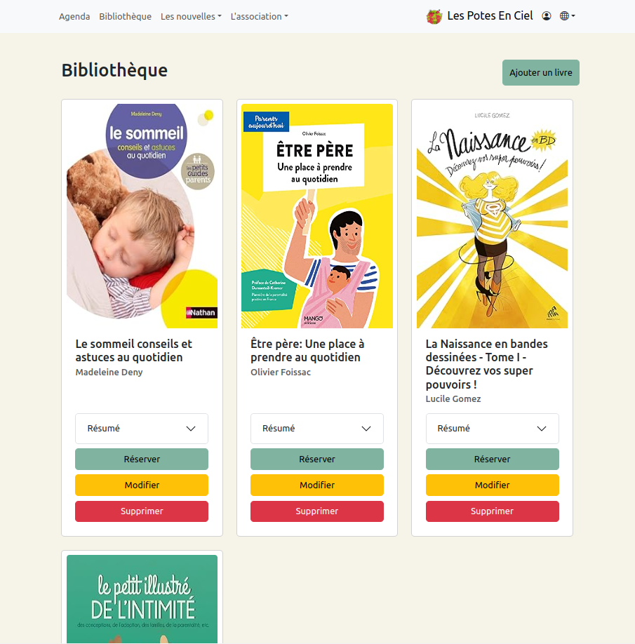
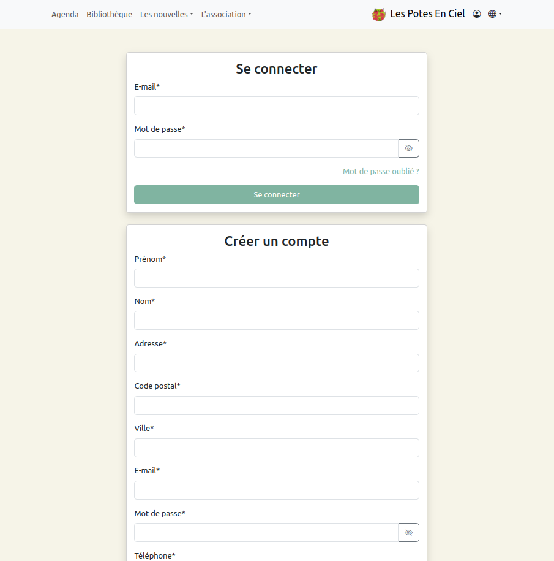
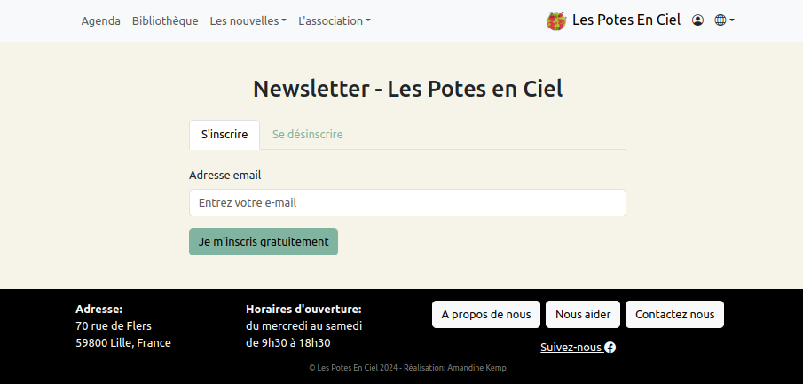

<p align="center">
    
</p>

----------

# <p align="center">Les Potes en Ciel: Enhancing Online Presence and Boosting Member Engagement</p>

----------

## Introduction

**Project Name:** Les Potes en Ciel

**Description:** This project aims to reinforce the online presence of the association Les Potes en Ciel and improve the engagement of members and supporters. Les Potes en Ciel is dedicated to promoting the well-being of children and families. The project includes creating interactive and informative platforms that facilitate communication and community engagement.

**Youtube video of a demo of the app:** [Les Potes en Ciel](https://www.youtube.com/watch?v=eRLAB-CGK_I)

**Deployed Site:** [Les Potes en Ciel](http://localhost:3000/)

**Blog Article:** [Final Project Blog Article](https://medium.com/@amandinekemp/blog-post-improving-online-presence-and-member-engagement-5ec8adffa047)

**Author:** [Amandine Kemp](https://www.linkedin.com/in/amandinekemp/)

----------

## ➤ Table of Contents


- [➤ Introduction](https://github.com/amandinekemp/Les_Potes_En_Ciel?tab=readme-ov-file#introduction)
- [➤ Features](https://github.com/amandinekemp/Les_Potes_En_Ciel?tab=readme-ov-file#-features)
- [➤ Technologies Used](https://github.com/amandinekemp/Les_Potes_En_Ciel?tab=readme-ov-file#-technologies-used)
- [➤ Installation](https://github.com/amandinekemp/Les_Potes_En_Ciel?tab=readme-ov-file#-installation)
- [➤ Usage](https://github.com/amandinekemp/Les_Potes_En_Ciel?tab=readme-ov-file#-usage)
- [➤ Acknowledgements](https://github.com/amandinekemp/Les_Potes_En_Ciel?tab=readme-ov-file#-acknowledgements)
- [➤ License](https://github.com/amandinekemp/Les_Potes_En_Ciel?tab=readme-ov-file#-license)
- [➤ Contact](https://github.com/amandinekemp/Les_Potes_En_Ciel?tab=readme-ov-file#-contact)

----------

## ➤ Features:

### 1. Library
**Description:**
- Access a collection of books available in the association's library.
- Option to borrow or cancel reservations online.
- Easy-to-use online tools to search the catalog, reserve books, and manage borrowing history.

**Screenshot:**


### 2. Authentication
**Description:**
- User-friendly login system with password recovery and multi-factor authentication.
- Allows users to change their password and register new users.

**Screenshot:**


### 3. Newsletter Subscription
**Description:**
- Subscribe to the newsletter to stay updated with the latest news and events from the association.
- Receive exclusive content, member testimonials, and information on community impact.

**Screenshot:**


----------

## ➤ Technologies Used

### Front-end :

- React
- React Bootstrap
- HTML
- CSS

### Back-end :

- Symfony
- Php
- MySQL

----------

## ➤ Installation

### Prerequisites

- Node.js (v14 or higher)
- npm

### Steps

1. Clone the repository:
  ```bash
  git clone https://github.com/amandinekemp/Les_Potes_En_Ciel.git
  ```

2. Navigate to the project directory:
  ```bash
  cd Les_Potes_En_Ciel
  ```

3. Install the dependencies:
  ```bash
  npm install
  ```

4. Run the development server:
  ```bash
  npm run dev
  ```

5. Open your browser and go to http://localhost:3000 to see the application running.

----------

## ➤ Usage

### Library

* Navigate to the Library section to browse, reserve, and manage books.

### Authentication

* Use the login feature to access your account. New users can register for an account, and existing users can manage their profiles.

### Newsletter Subscription

* Subscribe to the newsletter to receive the latest updates from the association.

----------

## ➤ Acknowledgements

I would like to express my gratitude to the members of the C22 class at Holberton School, and to those around me, for their invaluable support and advice throughout this project. Your encouragement, feedback and collaborative spirit were invaluable in bringing this project to fruition.

Thank you all so much!

----------


## ➤ License

* This project is licensed under the MIT License. See the [LICENSE ISC](LICENSE) file for details.

----------

## ➤ Contact

For any questions or inquiries, please contact:

* Amandine Kemp

  - [Github](https://github.com/amandinekemp)
  - [LinkedIn](https://www.linkedin.com/in/amandinekemp/)

 Thank you for your interest in the "Les Potes En Ciel" project!
